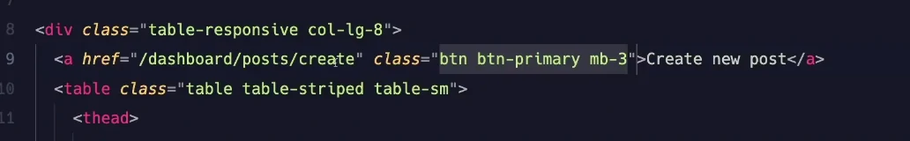
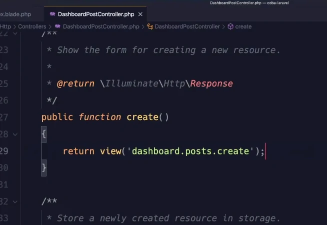
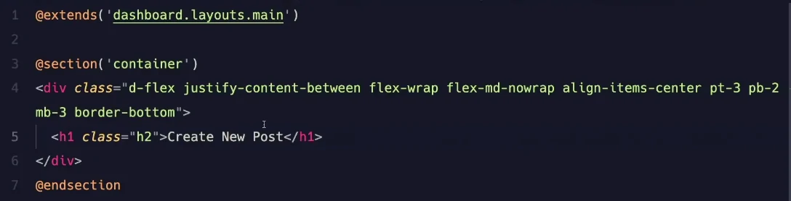
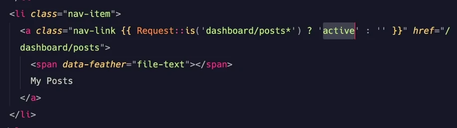
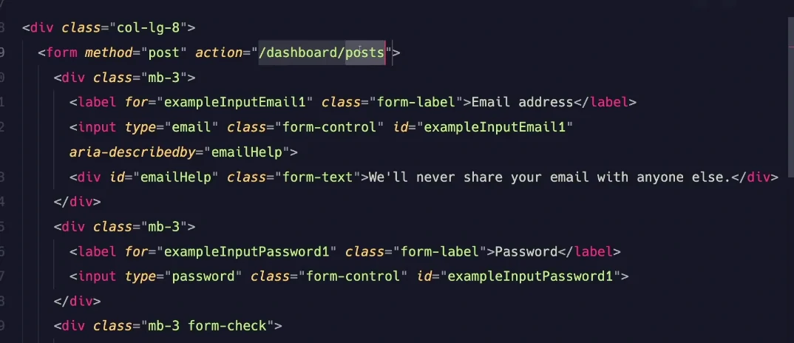
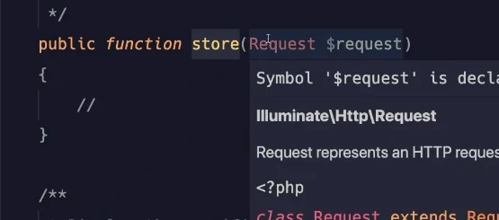
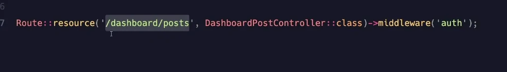
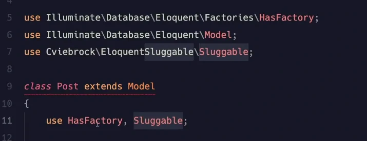
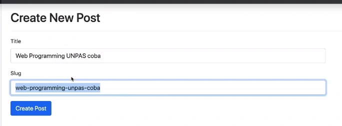
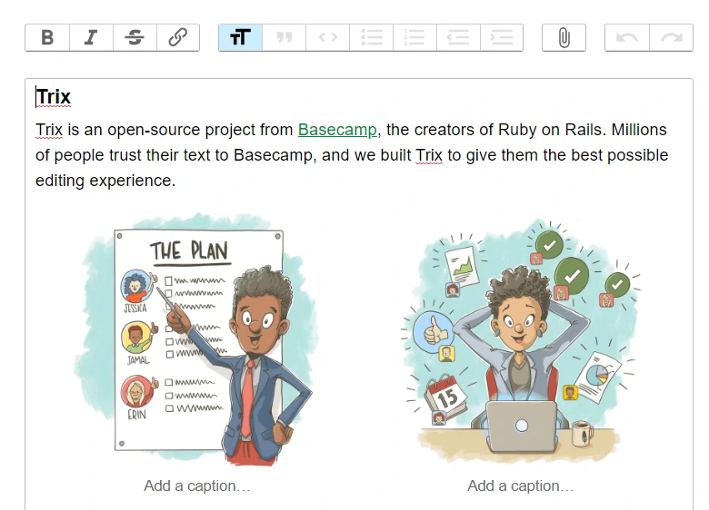

# Create Post Form

---

## menambahkan tombol postingan

Buka file _resource/views/posts/index.blade.php_



> tidak not found / 404: karena sudah ditangani oleh laravel / default

buka file _DashboardController.php_

kita ketikkan di method **create()**



kita buat file baru _resource/views/posts/create.blade.php_

> isinya kita copy dari halaman _post/index.blade.php_



kita buka _sidebar.blade.php_

> sebuah wildcard / \* berfungsi : apapun yang ada setelah tanda post akan membuat halaman ini active



kita buka lagi file _create.blade.php_ untuk kita membuat form

> kita kecilkan inputannnya untuk input di desktop

```html
<div class="col-lg-8"></div>
```





> form diatas jika digabung dengan method post akan mengarah ke method store di ControllerPostController **Karena kita pakai resource**



> jika halamannya menuju ke route diatas dengan method **get** dia akan langsung ke index, kalo method **post** akan langsung ke method store, **put** akan mengarahkan ke update, kalo **delete** akan mengarahkan ke destrory.

kalo kita menggunakan form jangan lupa menggunakan directive CSRF untuk menangani Cross Side Resource Forgery

```html
<div class="mb-3">
    <label for="title" class="form-label">Title</label>
    <input type="text" class="form-control" id="title" name="title" />
</div>
<div class="mb-3">
    <label for="slug" class="form-label">Slug</label>
    <input type="text" class="form-control" id="slug" name="slug" />
</div>
<button type="submit" class="btn btn-primary">Create Post</button>
```

kita akan membuat slugnya menjadi otomatis ketika pencet tab / pindah focus dari title.

kita butuh bantuan sebuah package tugasnya untuk membuat slug : **eloquent sluggable**

### Eloquent Sluggable

[Link Eloquent Sluggable](https://github.com/cviebrock/eloquent-sluggable)

kita install dulu lewat composer:

```
composer require cviebrock/eloquent-sluggable
```

kita copy script dibawah ini:

```php
use Cviebrock\EloquentSluggable\Sluggable;

class Post extends Model
{
    use Sluggable;

    /**
     * Return the sluggable configuration array for this model.
     *
     * @return array
     */
    public function sluggable(): array
    {
        return [
            'slug' => [
                'source' => 'title'
            ]
        ];
    }
}
```

> kita include kan namespacenya
> kita panggil track nya
> kita membuat method sluggable



> trait / use wajib kita bikin methodnya

> karena kita mau bikin ketika dari title langsung dibuat slugnya, harus menggunakan **javascript**

## membuat fetch API

kita buat method baru di file _DashboardPostController.php_ dengan nama **checkSlug**

```php
use \Cviebrock\EloquentSluggable\Services\SlugService;

public function checkSlug(Request $request) {
    $slug = SlugService::createSlug(Post::class, 'slug', $request->title);
    return response()->json(['slug' => $slug]);
}
```

> dibaca: CreateSlug mengambil dari class post, mengambil fieldnya slug, sumbernya / titlenya apa, slug akan berisi apapun hasilnya yag sudah diisi titlenya dan uniq dari database
> kita return dalam bentuk JSON, agar bisa bisa diolah oleh JSON javascript, dalam bentuk aray assoiative,

kita buat di _create.blade.php_ javascript

```js
const title = document.querySelector("#title");
const slug = document.querySelector("#slug");

title.addEventListener("change", function () {
    fetch("/dashboard/posts/checkSlug?title" + title.value)
        .then((response) => response.json())
        .then((data) => (slug.value = data.slug));
});
```

> setelah dapat promisenya resolve, data.slugnya masuk sebagai value diinputan slug

karena bukan bagian dari resource maka buat Routenya manual

```php
Route::get('/dashboard/posts/checkSlug', [DashboardPostController::class, 'checkSlug'])->middleware('auth');
```

Hasil:


> kita bisa membuat inputan slugnya **disable dan readonly**

## kita membuat select untuk category

kita edit method **create** di file _DashboardPostController.php_ agar bisa looping data dari models Category.

```php
use App\Models\Category;

public function create() {
    return view('dashboard.posts.create', [
        'categories' => Category:all();
    ]);
}
```

kita tambahkan script select:

```html
<div class="mb-3">
    <label for="category" class="form-label">Category</label>
    <select name="category_id" class="form-select">
        @foreach ($Categories as @category)
        <option value="{{ $category->id }}">{{ @category->name }}</option>
        @endforeach
    </select>
</div>
```

## menambahkan sebuah editor untuk menulis body

kita cari sebuah editor namanya **trix editor**

[link trix editor](https://github.com/basecamp/trix)



1. kita tambahkan 2 baris diatas halaman html kita

```html
<head>
    …
    <link rel="stylesheet" type="text/css" href="/css/trix.css" />
    <script type="text/javascript" src="/js/trix.js"></script>
</head>
```

2. kita download source codenya
3. kita tambahkan script untuk trix-editor, namanya harus sama
4. kita ambil file _dist/trix.js & dist/trix.css_ pindahkan ke folder public
5. kita tambahkan script:

```html
<div class="mb-3">
    <label for="body" class="form-label">Body</label>
    <input id="body" type="hidden" name="body" />
    <trix-editor input="body"></trix-editor>
</div>
```

### hilangkan file upload

hilangkan diCSS:

```html
<style>
    trix-toolbar [data-trix-button-group="file-tools"] {
        display: none;
    }
</style>
```

agar tidak jalan fitur nya kita kasih js:

```js
document.addEventListener(''trix-file-accept', function(){
    e.preventDefault();
});
```
