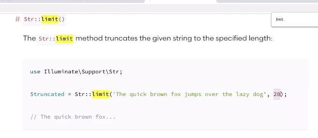

# Validation & Insert Post

---

> kita buka halaman **DashboardPostController.php**

```php
public function store(Request $request)
    {
        $validatedData = $request->validate([
            'title' => 'required|max:255',
            'slug' => 'required|unique:posts',
            'category_id' => 'required',
            'body' => 'required'
        ]);
    }
```

## untuk keamanan inputan

> kita buka halaman **create.blade.php**

```html
<div class="mb-3">
    <label for="title" class="form-label">Title</label>
    <input
        type="text"
        class="form-control @error('title') is-invalid @enderror"
        id="title"
        name="title"
        required
        autofocus
        value="{{ old('title') }}"
    />
    @error('title')
    <div class="invalid-feedback">{{ $message }}</div>
    @enderror
</div>
<div class="mb-3">
    <label for="slug" class="form-label">Slug</label>
    <input
        type="text"
        class="form-control @error('slug') is-invalid @enderror"
        id="slug"
        name="slug"
        required
        value="{{ old('slug') }}"
    />
    @error('slug')
    <div class="invalid-feedback">{{ $message }}</div>
    @enderror
</div>
<div class="mb-3">
    <label for="category" class="form-label">Category</label>
    <select name="category_id" class="form-select">
        @foreach ($Categories as @category) @if(old('category_id') ==
        $category->id)
        <option value="{{ $category->id }}" selected>
            {{ @category->name }}
        </option>
        @else
        <option value="{{ $category->id }}">{{ @category->name }}</option>
        @endif @endforeach
    </select>
</div>
<div class="mb-3">
    <label for="body" class="form-label">Body</label>
    @error('body')
    <p class="danger">{{ $message }}</p>
    @enderror
    <input type="hidden" id="body" name="body" value="{{ old('body') }}" />
    <trix-editor input="body"></trix-editor>
</div>
```

## membuat data baru

### Membuat validati user_id

> kita buka halaman **DashboardPostController.php**

```php
$validatedData['user_id'] = auth()->user()->id;
```

### Membuat limit untuk excerpt

Akan mengambil dari body
menggunakan limit hanya 100 karakter
seearch -> string helpers -> limit


```php
$validatedData['excerpt'] = Str::limit($request->body, 200, '...');
```

> jangan lupa kita panggil **Str**

```php
    use Illuminate\Support\Str;
```

### agar yang dikirim tulisannya saja tidak ada tag html

```php
$validatedData['excerpt'] = Str::limit(strip_tags($request->body), 200, '...');
```

### kita insert

```php
    Post::create($validatedData);
```

### kita kembalikan ke halaman post jika sudah selesai insert data

```php
    return redirect('/dashboard/posts')->with('success', 'New Post has been added!');
```

> kita buka halaman **dashboard/posts/index.blade.php**

```html
@if(session()->has('success'))
<div class="alert alert-success">{{ session('successs') }}</div>
@endif
```
